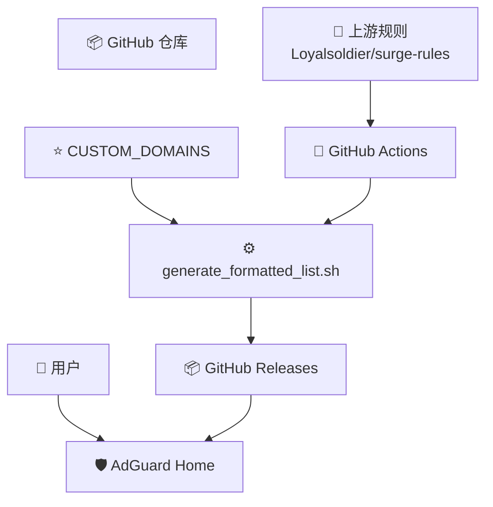
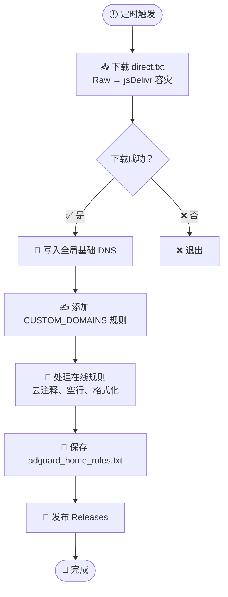
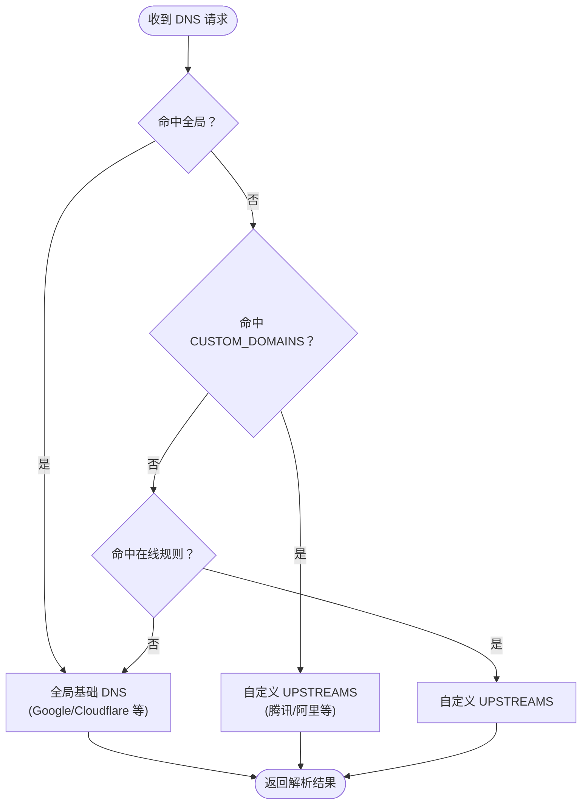

# 🚀 AdGuard Home 国内外域名 DNS 分流规则

**AI 生成 · 自动更新 · 开箱即用**

一套专为 **AdGuard Home** 打造的高质量 **国内外域名 DNS 分流规则**。  
自动同步上游规则，智能区分国内/国外域名，支持 DoH、DoT、DoQ、HTTP/3 等多种加密协议。

<p align="center">
  
  
  
  
  
</p>

<div align="center">
  <strong>🤖 AI 驱动 · ⚡ 每日自动同步 · 📦 GitHub Releases 订阅</strong>
</div>

---

## ✨ 项目简介

本项目专为 **AdGuard Home** 提供高质量的**国内外域名 DNS 分流规则**。

脚本 `generate_formatted_list.sh` 通过 GitHub Actions 实现全自动化：**自动下载 Loyalsoldier 上游规则 → 容灾切换 → 合并自定义域名 → 写入全局 DNS → 格式化输出**，真正做到每日无人值守更新。

> 💡 **核心脚本、Actions 工作流及生成逻辑全部由 AI 构建与优化。**

---

## 🌟 项目亮点

| 功能                  | 说明 |
|-----------------------|------|
| 🤖 **AI 驱动开发**    | 核心脚本与自动化流程均由 AI 编写并持续优化 |
| ⚙️ **全自动生成**     | 上游下载、清洗、去重、校验一气呵成 |
| 🔄 **每日同步**       | GitHub Actions 定时抓取最新规则变化 |
| 📦 **自动发布**       | 新规则自动打包上传至 GitHub Releases（直链订阅） |
| 🌏 **智能分流**       | 国内域名高速直连，国外域名防污染 |
| 🔐 **加密协议支持**   | 完美兼容 DoH、DoT、DoQ、HTTP/3 |
| 🚀 **容灾机制**       | GitHub Raw + jsDelivr CDN 双源自动切换 |
| 📝 **高度自定义**     | 通过 `CUSTOM_DOMAINS` 添加个人白名单 |

---

## 🏗️ 项目架构

### 项目工作流



### AI 自动化构建流程



### DNS 解析决策树



---

## 🚀 核心功能

### 🇨🇳 国内域名解析
`CUSTOM_DOMAINS` + 在线下载的国内域名规则统一使用自定义 `UPSTREAMS`（腾讯/阿里等高速节点）。

### 🌍 全局解析
未命中规则的域名使用脚本内置的全局 DNS 列表（Google、Cloudflare、AdGuard 等）。

### ⭐ 自定义白名单 (`CUSTOM_DOMAINS`)
支持添加游戏、国服、私有域名等，强制走自定义上游 DNS。

### 🔁 自动容灾下载
优先 GitHub Raw，失败自动切换 jsDelivr CDN。

---

## 🛰️ 默认 DNS 配置

<details>
<summary><b>全局基础 DNS</b></summary>

- Google DNS
- Cloudflare DNS
- AdGuard DNS
- Applied Privacy 等

</details>

<details>
<summary><b>自定义 UPSTREAMS（国内优先）</b></summary>

脚本中配置的 `UPSTREAMS` 数组（腾讯、阿里 DoH/DoT 等）
</details>

---

## 🌐 上游规则来源

核心数据来自 **[Loyalsoldier/surge-rules](https://github.com/Loyalsoldier/surge-rules)** 的 `direct.txt`。

---

## 🛠️ 本地构建

```bash
chmod +x generate_formatted_list.sh
./generate_formatted_list.sh
```

- 默认输出：`/tmp/adguard_home_rules.txt`
- 自定义输出：`OUTPUT_FILE=/path/to/rules.txt ./generate_formatted_list.sh`

---

## 📦 推荐订阅方式

**推荐直接订阅 GitHub Releases 中的每日自动规则文件**，AdGuard Home 可自动更新，无需本地运行脚本。

---

## ⚠️ 注意事项

- 确保宿主机网络畅通
- 可修改脚本中的 `UPSTREAMS` 和 `CUSTOM_DOMAINS`
- 私有域名建议写入 `CUSTOM_DOMAINS`

---

## 📜 许可协议

脚本基于 **GPLv3** 开源。域名规则数据归原仓库所有，请遵守其协议。

---

<div align="center">

## ❤️ 项目承诺

| 图标 | 承诺 |
|------|------|
| 🤖 | AI 驱动核心逻辑 |
| ⚙️ | 全自动规则处理 |
| 🔄 | 每日定时同步 |
| 📦 | Releases 多 CDN |
| 📝 | 轻量自定义 |

**公共规则自动同步 · 私有规则随心维护 · 稳定可靠**

⭐ **欢迎 Star 支持！**

</div>
