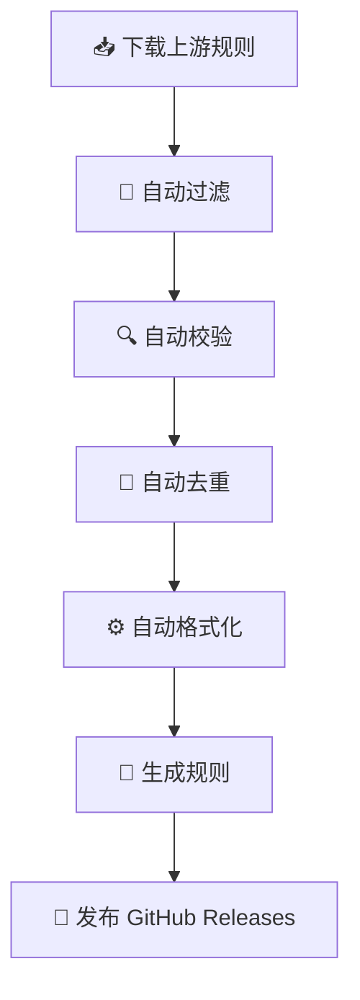
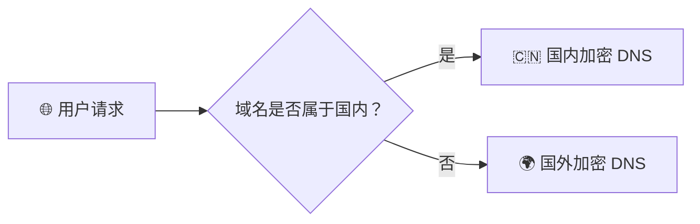

<div align="center">

# 🚀 AdGuard Home 国内外域名 DNS 分流规则

### **AI 生成代码 · 自动生成规则 · 每日自动更新 · 开箱即用**

一套专为 **AdGuard Home** 打造的高质量 DNS 分流规则，自动同步上游规则，智能区分国内外域名，支持多种加密 DNS 协议。

<p>


</p>

**🤖 AI 编写代码 · ⚡ 自动生成规则 · 🔄 每日自动同步 · 📦 自动发布 Release**

</div>

---

# ✨ 项目简介

本项目提供适用于 **AdGuard Home** 的国内外域名 DNS 分流规则。

规则文件由自动化程序生成，结合 GitHub Actions 定时同步上游规则，实现 **自动下载、自动过滤、自动校验、自动生成、自动发布**，真正做到长期无人值守。

> 💡 **本项目的脚本、GitHub Actions 工作流及规则生成逻辑均由 AI 生成。**

---

# 🌟 项目亮点

| 功能 | 说明 |
|:--|:--|
| 🤖 AI 编写代码 | 项目脚本及自动化流程均由 AI 生成 |
| ⚙️ 自动生成规则 | 自动下载、过滤、去重、格式化 |
| 🔄 每日自动更新 | GitHub Actions 定时同步 |
| 📦 自动发布 | 自动上传 GitHub Releases |
| 🌏 国内外智能分流 | 自动选择国内 / 国外 DNS |
| 🔐 加密 DNS | 支持 DoH、DoT、HTTP/3、DoQ |
| 🚀 下载容灾 | GitHub Raw + jsDelivr 双源 |
| 📝 自定义规则 | 支持维护自己的白名单 |

---

# 🤖 AI 自动化流程



整个流程全部自动执行。

> **仅 `CUSTOM_DOMAINS` 等少量自定义规则需要人工维护，其余规则均自动同步生成。**

---

# 🌏 DNS 分流逻辑



---

# 🚀 功能介绍

## 🇨🇳 国内域名

大陆域名及自定义白名单默认使用国内高速加密 DNS。

支持：

- ✅ DNS over HTTPS（DoH）
- ✅ DNS over TLS（DoT）
- ✅ HTTP/3 DNS

优势：

- 🚀 更快解析速度
- 🛡 防 DNS 污染
- 🔒 更好的隐私保护
- 🌐 更稳定连接

---

## 🌍 国外域名

未命中的域名默认使用国外 DNS。

特点：

- 🌎 国际访问稳定
- 🚀 多节点解析
- 🔐 全程加密
- 📡 自动负载

---

## ⭐ 自定义白名单

项目提供：

```bash
CUSTOM_DOMAINS
```

适用于：

- 游戏
- NAS
- CDN
- 企业服务
- 私有域名
- 上游暂未收录的网站

始终使用国内 DNS。

---

## 🔁 自动回退下载

```text
GitHub Raw
      │
      ▼
 下载失败
      │
      ▼
jsDelivr CDN
```

无需任何人工操作。

---

## 🔄 自动更新

每天 **北京时间 07:00** 自动执行：

- 📥 下载最新规则
- 🧹 自动过滤
- 🔍 自动校验
- ⚙️ 自动生成
- 📦 自动发布 Release
- ♻️ 自动删除旧版本

真正做到：

> **一次部署，长期自动更新。**

---

# 🛰 默认 DNS

<details>

<summary><b>🇨🇳 国内 DNS（点击展开）</b></summary>

默认使用：

- 腾讯 DNS（DoH）
- 腾讯 DNS（DoT）
- **阿里 DNS（DoT）**
- **阿里 DNS（HTTP/3）**

兼顾：

- 🚀 速度
- 🛡 安全
- 🔒 隐私
- 🌐 稳定

</details>

<details>

<summary><b>🌍 国外 DNS（点击展开）</b></summary>

默认包含：

- Google DNS
- Cloudflare DNS
- Quad9 DNS
- OpenDNS
- Applied Privacy DNS
- AdGuard DNS

支持：

- DoH
- DoT
- DoQ（QUIC）

</details>

---

# 🌐 上游规则来源

本项目主要使用：

| 来源 | 用途 |
|:--|:--|
| Loyalsoldier/surge-rules | 国内直连域名 |

使用：

```text
direct.txt
```

作为主要规则来源。

默认优先下载 GitHub Raw。

若失败则自动切换至 **jsDelivr CDN**。

---

# 🛠 使用方法

## 赋予执行权限

```bash
chmod +x generate_formatted_list.sh
```

## 生成规则

```bash
./generate_formatted_list.sh
```

默认输出：

```text
${TMPDIR:-/tmp}/adguard_home_rules.txt
```

指定输出：

```bash
OUTPUT_FILE=/path/to/adguard_home_rules.txt ./generate_formatted_list.sh
```

---

# 📦 推荐使用方式

推荐直接使用 **GitHub Releases** 中自动生成的规则文件。

无需：

- ❌ 配置环境
- ❌ 下载脚本
- ❌ 手动更新

只需将 Release 中的规则链接添加到 **AdGuard Home** 即可。

以后所有更新都会自动同步。

---

# ⚠️ 注意事项

- 请确保能够访问 GitHub Raw 或 jsDelivr。
- `UPSTREAMS` 可按需修改。
- `CUSTOM_DOMAINS` 用于维护个人白名单。
- 推荐直接订阅 GitHub Releases，无需自行运行脚本。

---

# 📜 许可协议

本项目脚本及 GitHub Actions 工作流采用 **GPLv3 License**。

规则数据来源于：

> **Loyalsoldier/surge-rules**

请在使用、修改或分发生成的规则文件时，同时遵守上游项目的许可证。

---

<div align="center">

# ❤️ 项目承诺

| | |
|:--:|:--:|
| 🤖 | AI 生成项目代码 |
| ⚙️ | 自动生成规则文件 |
| 🔄 | 自动同步上游规则 |
| 📦 | GitHub Actions 自动发布 |
| 📝 | 少量自定义规则人工维护 |

---

### 💡 我们坚持：

**公开规则自动同步**

**自定义规则按需维护**

**流程公开透明**

**更新稳定可靠**

---

⭐ **如果这个项目对你有帮助，欢迎点一个 Star 支持！**

**让 AI 负责开发，让自动化负责更新，让你专注于使用。**

</div>
