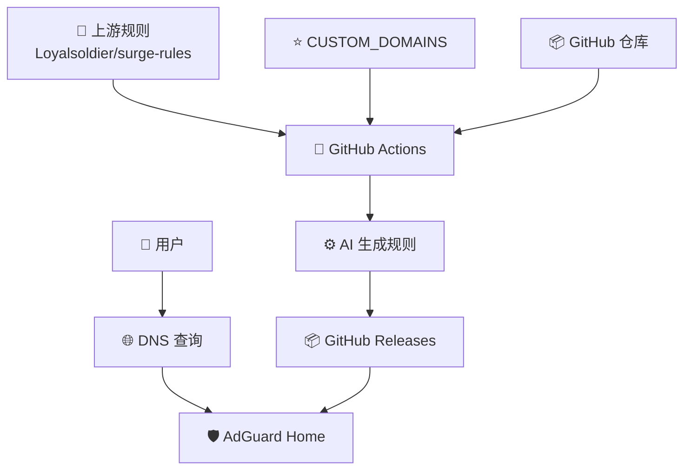
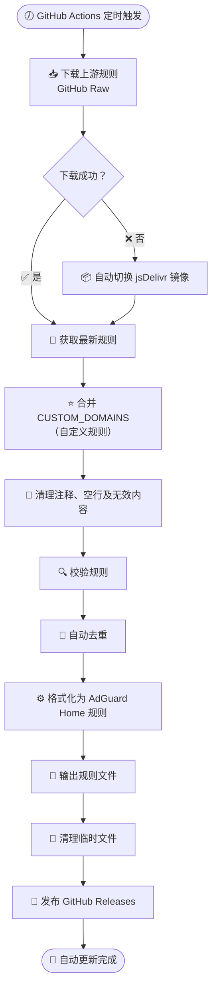
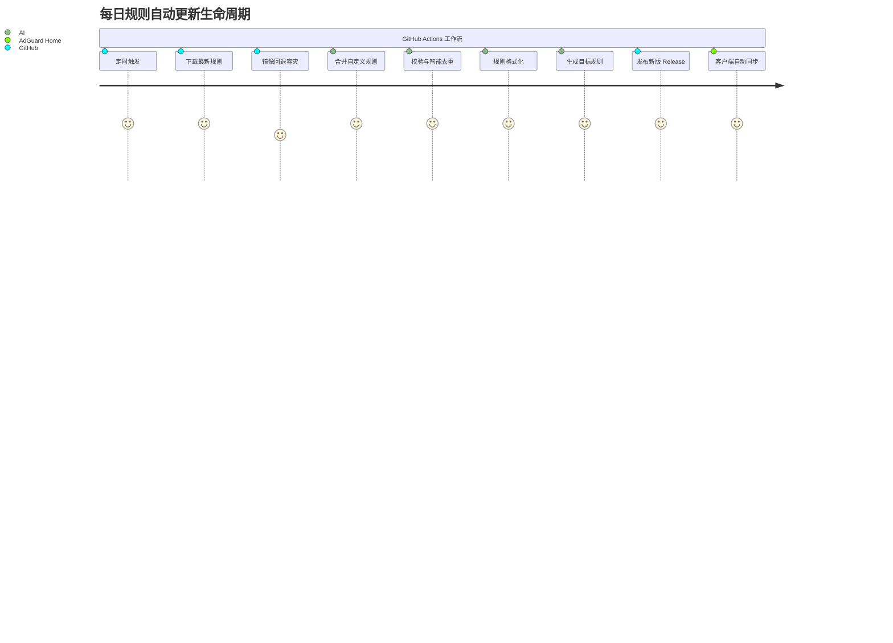
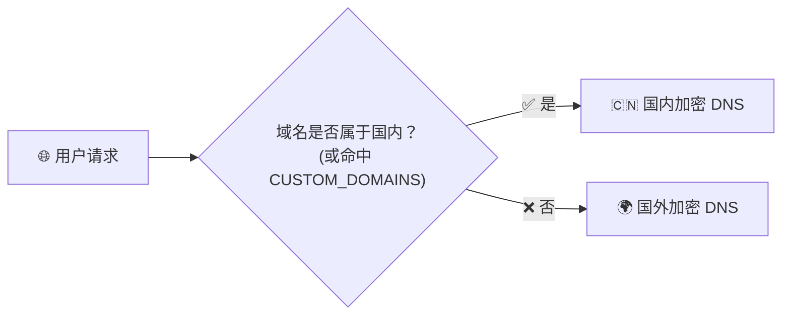
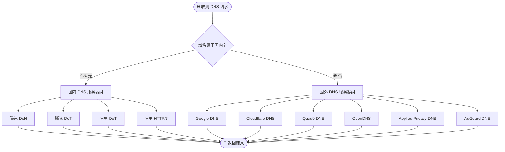

# 🚀 AdGuard Home 国内外域名 DNS 分流规则

### **AI 生成代码 · 自动生成规则 · 每日自动更新 · 开箱即用**

一套专为 **AdGuard Home** 打造的高质量 DNS 分流规则，自动同步上游规则，智能区分国内外域名，支持多种加密 DNS 协议。

<p align="center">


</p>

**🤖 AI 编写代码 · ⚡ 自动生成规则 · 🔄 每日自动同步 · 📦 自动发布 Release**

---

## ✨ 项目简介

本项目提供适用于 **AdGuard Home** 的国内外域名 DNS 分流规则。

规则文件由自动化程序生成，结合 GitHub Actions 定时同步上游规则，实现 **自动下载、自动过滤、自动校验、自动生成、自动发布**，真正做到长期无人值守。

> 💡 **本项目的脚本、GitHub Actions 工作流及规则生成逻辑均由 AI 自动构建与维护。**

---

## 🌟 项目亮点

| 功能 | 说明 |
| :--- | :--- |
| 🤖 **AI 协作开发** | 项目核心脚本及自动化流程均由 AI 编写和优化 |
| ⚙️ **全自动生成** | 自动完成上游下载、内容清洗、规则去重与合规校验 |
| 🔄 **每日高频同步** | 每天定时通过 GitHub Actions 抓取最新上游域名变化 |
| 📦 **自动版本发布** | 自动打包并上传至 GitHub Releases，提供直链订阅 |
| 🌏 **国内外分流** | 智能决策，国内域名高速直连，国外域名防污染解析 |
| 🔐 **主流加密支持** | 完美兼容 DoH、DoT、HTTP/3 及 DoQ 等多种加密协议 |
| 🚀 **双源下载容灾** | GitHub Raw 与 jsDelivr CDN 智能双源回退，免除下载失败困扰 |
| 📝 **灵活自定义** | 支持通过 `CUSTOM_DOMAINS` 维护个人的白名单与本地规则 |

---

## 🏗️ 架构与自动化流程

### 1. 项目工作架构
项目通过本地配置与上游规则源的双向输入，依托 GitHub Actions 驱动自动化生成器，最终交付至 AdGuard Home 客户端。



---

### 2. AI 自动化构建流程
GitHub Actions 定时触发后，执行从下载到发布、清理的闭环流水线，确保规则的高可用与纯净度。



---

### 3. 每日更新生命周期
每日规则更新时间线与协作角色的直观展示：



---

## 🌏 DNS 智能分流设计

### 1. 智能分流逻辑
客户端发起 DNS 请求后，解析引擎优先检索本地规则与分流名单，从而决定上游解析去向。



---

### 2. DNS 解析决策树
详细展示了请求到达后，分流策略向各加密 DNS 服务组分发及最终返回结果的完整链路：



---

## 🚀 核心功能介绍

### 🇨🇳 国内域名解析
针对中国大陆境内的域名及自定义白名单中的条目，默认分流至国内高速加密 DNS 服务器组。
*   **支持协议**：DNS over HTTPS（DoH）、DNS over TLS（DoT）、HTTP/3 DNS。
*   **核心优势**：极致的解析响应速度，从根源防止国内域名的 DNS 污染，提供更佳的隐私安全保障与高稳定性。

### 🌍 国外域名解析
未命中大陆规则或白名单的域名，将自动流向国外安全加密 DNS 服务组。
*   **核心优势**：国际方向访问连接顺畅，多区域节点智能负载，全程传输加密（防中间人篡改），确保解析结果真实可靠。

### ⭐ 自定义白名单 (`CUSTOM_DOMAINS`)
项目预留了自定义配置文件接口，适用于：
*   国服游戏、本地 NAS 服务、国内 CDN 节点。
*   企业内网私有服务、局域网私有域名。
*   上游公共规则暂未收录的全新国内网站。
*   *配置在此文件中的域名将始终强制使用国内 DNS 进行解析。*

### 🔁 自动容灾下载
在构建阶段，如果遇到上游网络波动导致 GitHub Raw 访问失败，脚本将无缝启动自动回退机制：
```text
GitHub Raw (首选) ──► [失败] ──► jsDelivr CDN (备用)
```
整个容灾过程在后台静默运行，无需任何人手动干预。

---

## 🛰️ 默认 DNS 上游服务配置

<details>
<summary><b>🇨🇳 国内 DNS 组（点击展开）</b></summary>

默认集成以下高信誉国内节点：
*   **腾讯 DNS** (DoH / DoT)
*   **阿里 DNS** (DoT / HTTP/3)

*兼顾超低延迟、防劫持防护与隐私去标识化。*

</details>

<details>
<summary><b>🌍 国外 DNS 组（点击展开）</b></summary>

默认集成全球主流安全节点：
*   **Google DNS** (DoH / DoT)
*   **Cloudflare DNS** (DoH / DoT)
*   **Quad9 DNS** (DoH / DoT)
*   **OpenDNS** (DoH)
*   **Applied Privacy DNS** (DoT / DoQ)
*   **AdGuard DNS** (DoQ / DoH)

*全面支持 DoH、DoT 以及极速的 DoQ (DNS over QUIC)。*

</details>

---

## 🌐 上游规则来源说明

本规则的核心域名数据源自高可靠的公共规则库：

| 来源仓库 | 核心用途 | 采用规则文件 |
| :--- | :--- | :--- |
| **Loyalsoldier/surge-rules** | 提取大陆直连域名 | `direct.txt` |

*默认优先通过 GitHub 官方 Raw 地址获取，若拉取超时或失败则自动平滑切换至 jsDelivr CDN。*

---

## 🛠️ 使用与本地构建指南

如果您希望在本地环境中自行生成此规则，可按照以下步骤操作：

### 1. 赋予脚本执行权限
```bash
chmod +x generate_formatted_list.sh
```

### 2. 运行脚本生成规则
```bash
./generate_formatted_list.sh
```
*   **默认输出路径**：`/tmp/adguard_home_rules.txt`
*   **自定义输出路径**：
    ```bash
    OUTPUT_FILE=/path/to/your_rules.txt ./generate_formatted_list.sh
    ```

---

## 📦 极力推荐的订阅方式

对于绝大多数用户，**不建议**在本地自行运行构建脚本。推荐直接订阅项目 **GitHub Releases** 中由 Actions 每日自动构建发布的成熟规则文件：

1.  **无需配置**：免去本地搭建 Shell 或 Actions 运行环境的烦恼。
2.  **无需手动**：一次配置到 AdGuard Home 后，客户端将根据更新策略自动静默拉取。
3.  **零运维成本**：真正享受「一次部署，一劳永逸」的分流体验。

---

## ⚠️ 注意事项

*   请确保您的 AdGuard Home 宿主机具有畅通的外部网络连接（用于拉取上游规则）。
*   可根据个人实际使用场景，自由修改脚本中的 `UPSTREAMS` 配置。
*   请将经常变动、或不常被公网上游收录的内网/个人域名写入 `CUSTOM_DOMAINS`。

---

## 📜 许可协议

本项目附带的自动化构建脚本及 GitHub Actions 工作流配置文件均基于 **GPLv3 开源许可证** 发布。
项目使用的基础域名规则数据归原作者 [Loyalsoldier/surge-rules] 所有，请在使用或二次分发时一并遵守上游项目的相关授权协议。

---

<div align="center">

## ❤️ 项目运行承诺

| 图标 | 承诺细节说明 |
| :---: | :--- |
| 🤖 | 所有核心代码与脚本逻辑由 **AI 协作构建并进行高标准审查** |
| ⚙️ | 规则文件的格式化、去重、清洗**全部交给全自动流水线** |
| 🔄 | 保持与上游规则源**每日定时强同步**，拒绝规则过期 |
| 📦 | 稳定托管于 GitHub Releases，**提供多 CDN 备用直链接** |
| 📝 | 保持轻量化，**人工仅聚焦于高定制化的自定义白名单** |

---

### 💡 我们的原则：

**公共规则自动同步 · 私有规则随心维护 · 过程公开透明 · 运行稳如磐石**

---

⭐ **如果这个项目切中您的痛点并带来了便利，欢迎点击右上角 Star 支持我们！**

**让 AI 负责繁琐的开发，让 Actions 负责辛勤的更新，而您，只需专注于无感、畅快的网络体验。**

</div>
